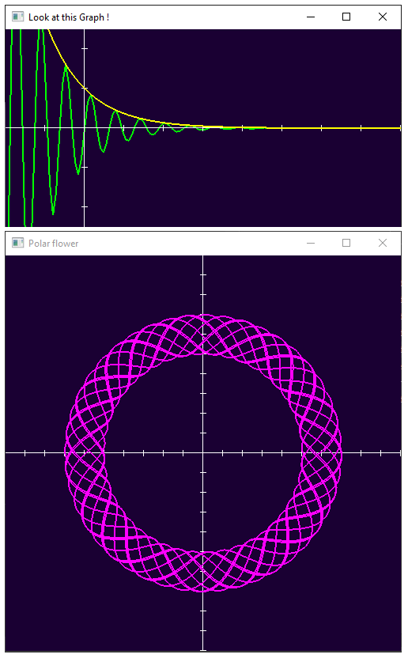

# lemniscate
A little header only C++ grapher

## Dependencies
Make sure you have `glfw3`, `glew` and `glm` already installed
## Getting started
Clone this repo using : <br />
```
$ git clone https://github.com/hazyuun/lemniscate.git
```
And check example.cpp for a usage example

## Screenshots

